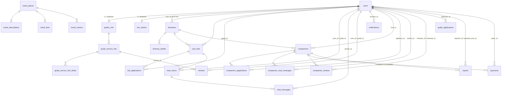

# Travel Busan — DB 전체 스키마

PostgreSQL 기준 전체 스키마 생성 스크립트다. 백엔드 `Backend/src/main/java/**/entity/*.java`(JPA 엔티티 21개)와 `Backend/sql/*.sql`(마이그레이션 9개)을 전수 대조해 재구성했다.

- **DBMS**: PostgreSQL (`jdbc:postgresql://localhost:5432/travelbusan`)
- **Hibernate**: `ddl-auto: validate` — 스키마를 애플리케이션이 만들지 않는다. 아래 DDL을 **수동 실행**해야 한다.
- **네이밍**: Spring Boot 기본 `CamelCaseToUnderscoresNamingStrategy` (camelCase → snake_case)
- **UUID PK**: `GenerationType.UUID`로 애플리케이션(Hibernate)이 채운다. 그래서 `DEFAULT gen_random_uuid()`를 **걸지 않는다**. (pgcrypto 의존 회피)
- 아래 스크립트는 **위에서 아래 순서 그대로** 실행하면 FK 의존성이 모두 해결된다.

---

## 1. 테이블 목록 (26개)

| # | 테이블 | 도메인 | PK 타입 | 근거 |
|---|--------|--------|---------|------|
| 1 | `users` | user | UUID | `User.java` + 마이그레이션 4건 |
| 2 | `guider_info` | guider | UUID (users FK 공유) | `GuiderInfo.java` |
| 3 | `travel_places` | recommend_place | INTEGER | `TravelPlace.java` + 네이티브 쿼리 |
| 4 | `travel_descriptions` | recommend_place | INTEGER | `TravelPlaceService` JOIN ⚠️추정 |
| 5 | `travel_fees` | planner(RAG) | INTEGER | `PlannerService` JOIN ⚠️추정 |
| 6 | `travel_vectors` | planner(RAG) | BIGINT | `PlannerService` pgvector 검색 ⚠️추정 |
| 7 | `itineraries` | planner | BIGINT | `Itinerary.java` |
| 8 | `itinerary_details` | planner | BIGINT | `ItineraryDetail.java` |
| 9 | `guide_service_info` | guide | UUID | `GuideProduct.java` |
| 10 | `guide_service_info_detail` | guide | UUID | `GuideServiceDetail.java` |
| 11 | `user_bids` | userbid | UUID | `UserBid.java` |
| 12 | `bid_applications` | bidapplication | UUID | `BidApplication.java` |
| 13 | `chat_rooms` | chat | UUID | `ChatRoom.java` |
| 14 | `chat_messages` | chat | UUID | `ChatMessage.java` |
| 15 | `reviews` | review | UUID | `Review.java` |
| 16 | `fcm_tokens` | notification | UUID | `FcmToken.java` |
| 17 | `notifications` | notification | UUID | `2026-08_create_notifications_table.sql` |
| 18 | `companions` | companion | UUID | `2026-08_create_companion_tables.sql` 외 3건 |
| 19 | `companion_applications` | companion | UUID | `2026-08_create_companion_tables.sql` |
| 20 | `companion_chat_messages` | companion | UUID | `2026-08_create_companion_chat_table.sql` |
| 21 | `companion_reviews` | companion | UUID | `2026-08_create_companion_reviews.sql` |
| 22 | `guide_applications` | guideconversion | UUID | `2026-08_create_guide_applications.sql` |
| 23 | `reports` | report | UUID | `2026-08_create_reports_and_sanctions.sql` |
| 24 | `payments` | payment | UUID | `2026-08_create_payments.sql` |
| 25 | `travel_place_translations` | i18n | (place_id, lang_code) | `2026-08_add_i18n.sql` |
| 26 | `translation_cache` | i18n | BIGINT | `2026-08_add_i18n.sql` |

> ⚠️ **추정 표시 4개 테이블**(`travel_descriptions`, `travel_fees`, `travel_vectors`, `travel_places.location`)은 JPA 엔티티가 없고 네이티브 SQL에서만 참조된다. TourAPI 수집·임베딩 파이프라인으로 외부 적재된 테이블이라, 쿼리에서 실제로 쓰이는 컬럼만 복원했다. 운영 DB에 다른 컬럼이 더 있을 수 있다.

---

## 2. ERD



---

## 3. 전체 스키마 생성 스크립트

### 3.0 사전 준비 — DB · 확장

```sql
-- DB 생성 (psql 슈퍼유저로 1회)
CREATE DATABASE travelbusan
    WITH ENCODING 'UTF8'
         LC_COLLATE = 'ko_KR.UTF-8'
         LC_CTYPE   = 'ko_KR.UTF-8'
         TEMPLATE = template0;

\c travelbusan

-- AI 플래너 RAG 검색(<=> 연산자)에 필요
CREATE EXTENSION IF NOT EXISTS vector;
```

---

### 3.1 `users` — 사용자

```sql
CREATE TABLE IF NOT EXISTS users (
    user_id               UUID         PRIMARY KEY,
    email                 VARCHAR(255) NOT NULL UNIQUE,
    password              VARCHAR(255) NOT NULL,          -- BCrypt 해시
    nickname              VARCHAR(100) NOT NULL,
    social_provider       VARCHAR(50),
    profile_image_url     TEXT,
    is_guide              BOOLEAN      NOT NULL DEFAULT false,
    failed_login_attempts INTEGER      NOT NULL DEFAULT 0,

    -- Phase 0: 본인 인증 / 동행 프로필
    phone_number          VARCHAR(30),
    phone_verified        BOOLEAN      NOT NULL DEFAULT false,
    birth_year            INTEGER,
    gender                VARCHAR(10),                    -- MALE / FEMALE / OTHER

    -- Phase 4: 동행 이력 (가이드 전환 심사 기초 자료)
    companion_host_count  INTEGER      NOT NULL DEFAULT 0,
    companion_join_count  INTEGER      NOT NULL DEFAULT 0,

    -- Phase 5: 신뢰·안전 (노쇼·제재)
    no_show_count         INTEGER      NOT NULL DEFAULT 0,
    sanction_level        VARCHAR(20)  NOT NULL DEFAULT 'NONE',  -- NONE / WARNED / RESTRICTED / BANNED
    restricted_until      TIMESTAMP,                      -- RESTRICTED일 때만 값 존재

    -- Phase 6: 예비 가이드 배지
    preliminary_guide     BOOLEAN      NOT NULL DEFAULT false,

    -- 다국어: 알림을 이 사용자의 언어로 만들기 위한 값
    -- (Accept-Language는 '요청을 보낸 사람'의 언어라 알림 수신자에게는 쓸 수 없다)
    preferred_lang        VARCHAR(10)  NOT NULL DEFAULT 'ko'   -- ko/en/ja/zh-CN/vi/id
);

CREATE INDEX IF NOT EXISTS idx_users_email ON users(email);
```

### 3.2 `guider_info` — 가이드 프로필 (users와 PK 공유, `@MapsId`)

```sql
CREATE TABLE IF NOT EXISTS guider_info (
    guide_id            UUID          PRIMARY KEY REFERENCES users(user_id),
    active_regions      VARCHAR(50)[] NOT NULL,
    available_languages VARCHAR(50)[] NOT NULL,
    experience_period   VARCHAR(20)   NOT NULL,
    language_scores     JSONB,                         -- [{language, testName, score}, ...]
    introduction        VARCHAR(500),
    specialties         VARCHAR(50)[] NOT NULL,
    certification_score NUMERIC(5,2)  DEFAULT 0,
    review_score        NUMERIC(3,2)  DEFAULT 0
);

-- 배열 컬럼 = ANY(...) 검색용 (GuiderInfoRepository 네이티브 쿼리)
CREATE INDEX IF NOT EXISTS idx_guider_info_active_regions ON guider_info USING GIN (active_regions);
CREATE INDEX IF NOT EXISTS idx_guider_info_specialties    ON guider_info USING GIN (specialties);
```

### 3.3 `travel_places` — 부산 관광지 마스터 (TourAPI 적재)

```sql
CREATE TABLE IF NOT EXISTS travel_places (
    place_id     INTEGER PRIMARY KEY,   -- TourAPI contentid
    title        VARCHAR(255),
    addr1        VARCHAR(255),
    first_image  TEXT,
    first_image2 TEXT,
    cat1         VARCHAR(50),
    cat2         VARCHAR(50),
    cat3         VARCHAR(50),
    location     POINT                  -- ⚠️ location[0]=mapx(경도), location[1]=mapy(위도)
);

CREATE INDEX IF NOT EXISTS idx_travel_places_cat1  ON travel_places(cat1);
CREATE INDEX IF NOT EXISTS idx_travel_places_title ON travel_places(title);
```

> `PlannerService`가 `p.location[0]`, `p.location[1]`로 접근한다. PostgreSQL 배열은 1-based라 `[0]`이 NULL이 되므로, **0-based 첨자를 갖는 `POINT` 타입**으로 확정했다. (배열로 만들려면 `DOUBLE PRECISION[]` + 쿼리를 `[1]`,`[2]`로 수정해야 한다.)

### 3.4 `travel_descriptions` — 장소 상세 설명 ⚠️추정

```sql
CREATE TABLE IF NOT EXISTS travel_descriptions (
    place_id INTEGER PRIMARY KEY REFERENCES travel_places(place_id),
    homepage TEXT,
    overview TEXT
);
```

### 3.5 `travel_fees` — 이용 시간·요금 ⚠️추정

```sql
CREATE TABLE IF NOT EXISTS travel_fees (
    place_id INTEGER PRIMARY KEY REFERENCES travel_places(place_id),
    use_time TEXT
);
```

### 3.6 `travel_vectors` — RAG 임베딩 ⚠️추정

```sql
-- 임베딩 모델: intfloat/multilingual-e5-base → 768차원 (main.py)
CREATE TABLE IF NOT EXISTS travel_vectors (
    vector_id     BIGSERIAL PRIMARY KEY,
    place_id      INTEGER NOT NULL REFERENCES travel_places(place_id),
    content_chunk TEXT    NOT NULL,
    embedding     VECTOR(768) NOT NULL
);

CREATE INDEX IF NOT EXISTS idx_travel_vectors_place ON travel_vectors(place_id);
-- 코사인 거리(<=>) ANN 인덱스
CREATE INDEX IF NOT EXISTS idx_travel_vectors_embedding
    ON travel_vectors USING ivfflat (embedding vector_cosine_ops) WITH (lists = 100);
```

### 3.7 `itineraries` — 여행 일정

```sql
CREATE TABLE IF NOT EXISTS itineraries (
    itinerary_id BIGSERIAL    PRIMARY KEY,
    user_id      UUID         NOT NULL,   -- 논리 FK (엔티티가 UUID 원시값으로만 보유)
    title        VARCHAR(255) NOT NULL,
    region       VARCHAR(255),
    start_date   DATE,
    end_date     DATE,
    created_at   TIMESTAMP
);

CREATE INDEX IF NOT EXISTS idx_itineraries_user ON itineraries(user_id);
```

### 3.8 `itinerary_details` — 일정 상세 코스

```sql
CREATE TABLE IF NOT EXISTS itinerary_details (
    detail_id        BIGSERIAL    PRIMARY KEY,
    itinerary_id     BIGINT       REFERENCES itineraries(itinerary_id) ON DELETE CASCADE,
    day_number       INTEGER      NOT NULL,
    start_time       TIME,
    duration_minutes INTEGER,
    place_name       VARCHAR(255) NOT NULL,
    category_type    TEXT[],
    operating_hours  VARCHAR(255),
    description      TEXT,
    place_id         BIGINT,               -- travel_places 원본 참조 (nullable, 논리 FK)
    sort_order       INTEGER      NOT NULL,
    latitude         DOUBLE PRECISION,
    longitude        DOUBLE PRECISION
);

CREATE INDEX IF NOT EXISTS idx_itinerary_details_itinerary ON itinerary_details(itinerary_id);
CREATE INDEX IF NOT EXISTS idx_itinerary_details_place     ON itinerary_details(place_id);
```

### 3.9 `guide_service_info` — 가이드 상품

```sql
CREATE TABLE IF NOT EXISTS guide_service_info (
    service_id          UUID          PRIMARY KEY,
    guide_id            UUID          NOT NULL REFERENCES guider_info(guide_id),
    title               VARCHAR(255)  NOT NULL,
    description         TEXT          NOT NULL,
    region              VARCHAR(100)  NOT NULL,
    duration_minutes    INTEGER       NOT NULL,
    max_capacity        INTEGER       NOT NULL,
    price_per_person    NUMERIC(10,2) NOT NULL,
    has_car             BOOLEAN       DEFAULT false,
    available_languages VARCHAR(50)[] NOT NULL,
    meeting_point       VARCHAR(255)  NOT NULL,
    meeting_point_desc  TEXT,
    included_items      JSONB,
    excluded_items      JSONB,
    related_materials   JSONB,
    created_at          TIMESTAMP,
    updated_at          TIMESTAMP,
    is_published        BOOLEAN       DEFAULT false
);

CREATE INDEX IF NOT EXISTS idx_guide_service_info_guide     ON guide_service_info(guide_id);
CREATE INDEX IF NOT EXISTS idx_guide_service_info_published ON guide_service_info(is_published);
CREATE INDEX IF NOT EXISTS idx_guide_service_info_region    ON guide_service_info(region);
```

### 3.10 `guide_service_info_detail` — 가이드 상품 타임라인

```sql
CREATE TABLE IF NOT EXISTS guide_service_info_detail (
    detail_id      UUID         PRIMARY KEY,
    service_id     UUID         NOT NULL REFERENCES guide_service_info(service_id),
    sequence_order INTEGER      NOT NULL,
    start_time     TIME         NOT NULL,
    end_time       TIME         NOT NULL,
    location       VARCHAR(255) NOT NULL,
    content        TEXT         NOT NULL
);

CREATE INDEX IF NOT EXISTS idx_guide_service_detail_service ON guide_service_info_detail(service_id);
```

### 3.11 `user_bids` — 가이드 마켓: 사용자 일정 제안

```sql
CREATE TABLE IF NOT EXISTS user_bids (
    bid_id       UUID        PRIMARY KEY,
    itinerary_id BIGINT      NOT NULL REFERENCES itineraries(itinerary_id),
    user_id      UUID        NOT NULL REFERENCES users(user_id),
    status       VARCHAR(20) NOT NULL DEFAULT 'PENDING',  -- PENDING / ACCEPTED / REJECTED
    created_at   TIMESTAMP   NOT NULL DEFAULT now(),
    is_closed    BOOLEAN     NOT NULL DEFAULT false
);

CREATE INDEX IF NOT EXISTS idx_user_bids_user   ON user_bids(user_id);
CREATE INDEX IF NOT EXISTS idx_user_bids_status ON user_bids(status);
```

### 3.12 `bid_applications` — 가이드의 입찰 지원

```sql
CREATE TABLE IF NOT EXISTS bid_applications (
    application_id UUID      PRIMARY KEY,
    bid_id         UUID      NOT NULL REFERENCES user_bids(bid_id),
    guide_id       UUID      NOT NULL REFERENCES users(user_id),
    created_at     TIMESTAMP NOT NULL DEFAULT now(),
    CONSTRAINT uk_bid_applications_bid_guide UNIQUE (bid_id, guide_id)
);

CREATE INDEX IF NOT EXISTS idx_bid_applications_guide ON bid_applications(guide_id);
```

### 3.13 `chat_rooms` — 1:1 채팅방 (사용자 ↔ 가이드)

```sql
CREATE TABLE IF NOT EXISTS chat_rooms (
    room_id    UUID      PRIMARY KEY,
    bid_id     UUID      REFERENCES user_bids(bid_id),   -- nullable
    user_id    UUID      NOT NULL REFERENCES users(user_id),
    guide_id   UUID      NOT NULL REFERENCES users(user_id),
    is_closed  BOOLEAN   NOT NULL DEFAULT false,
    created_at TIMESTAMP NOT NULL DEFAULT now()
);

CREATE INDEX IF NOT EXISTS idx_chat_rooms_user  ON chat_rooms(user_id);
CREATE INDEX IF NOT EXISTS idx_chat_rooms_guide ON chat_rooms(guide_id);
```

### 3.14 `chat_messages`

```sql
CREATE TABLE IF NOT EXISTS chat_messages (
    message_id UUID      PRIMARY KEY,
    room_id    UUID      NOT NULL REFERENCES chat_rooms(room_id),
    sender_id  UUID      NOT NULL REFERENCES users(user_id),
    content    TEXT      NOT NULL,
    is_read    BOOLEAN   NOT NULL DEFAULT false,
    created_at TIMESTAMP NOT NULL DEFAULT now()
);

CREATE INDEX IF NOT EXISTS idx_chat_messages_room         ON chat_messages(room_id);
CREATE INDEX IF NOT EXISTS idx_chat_messages_room_created ON chat_messages(room_id, created_at);
```

### 3.15 `reviews` — 가이드 상품 리뷰

```sql
CREATE TABLE IF NOT EXISTS reviews (
    review_id  UUID         PRIMARY KEY,
    guide_id   UUID         NOT NULL REFERENCES users(user_id),
    user_id    UUID         NOT NULL REFERENCES users(user_id),
    service_id UUID         REFERENCES guide_service_info(service_id),  -- nullable
    rating     NUMERIC(2,1) NOT NULL,   -- 1.0 ~ 5.0
    content    TEXT,
    created_at TIMESTAMP    NOT NULL DEFAULT now()
);

CREATE INDEX IF NOT EXISTS idx_reviews_guide   ON reviews(guide_id);
CREATE INDEX IF NOT EXISTS idx_reviews_service ON reviews(service_id);
```

### 3.16 `fcm_tokens` — 푸시 토큰 (users와 PK 공유)

```sql
CREATE TABLE IF NOT EXISTS fcm_tokens (
    user_id    UUID PRIMARY KEY REFERENCES users(user_id),
    token      TEXT NOT NULL,
    updated_at TIMESTAMP
);
```

### 3.17 `notifications` — 인앱 알림 이력 (Phase 3)

```sql
CREATE TABLE IF NOT EXISTS notifications (
    notification_id UUID         PRIMARY KEY,
    receiver_id     UUID         NOT NULL REFERENCES users(user_id),
    title           VARCHAR(100) NOT NULL,
    body            TEXT         NOT NULL,
    is_read         BOOLEAN      NOT NULL DEFAULT false,
    created_at      TIMESTAMP    NOT NULL DEFAULT now()
);

CREATE INDEX IF NOT EXISTS idx_notifications_receiver        ON notifications(receiver_id);
CREATE INDEX IF NOT EXISTS idx_notifications_receiver_unread ON notifications(receiver_id, is_read);
```

### 3.18 `companions` — 동행 모집글 (Phase 1 / 4 / 7)

```sql
CREATE TABLE IF NOT EXISTS companions (
    companion_id      UUID         PRIMARY KEY,
    itinerary_id      BIGINT       NOT NULL REFERENCES itineraries(itinerary_id),
    host_id           UUID         NOT NULL REFERENCES users(user_id),
    title             VARCHAR(100) NOT NULL,
    min_participants  INTEGER      NOT NULL,
    max_participants  INTEGER      NOT NULL,
    preference_tags   TEXT[],
    cost_sharing_note TEXT,
    description       TEXT,
    status            VARCHAR(20)  NOT NULL DEFAULT 'RECRUITING',
    start_date        DATE,
    end_date          DATE,
    created_at        TIMESTAMP    NOT NULL DEFAULT now(),

    -- Phase 4: 더블 블라인드 리뷰 공개 기한(7일) 계산 기준
    completed_at      TIMESTAMP,
    -- Phase 7: 모집글 부스트 만료 시각
    boosted_until     TIMESTAMP,
    -- 탐색 필터: 모집 나이대(둘 다 NULL이면 연령 무관) · 방장 SNS
    min_age           INTEGER,
    max_age           INTEGER,
    sns_handle        VARCHAR(50)
);

CREATE INDEX IF NOT EXISTS idx_companions_status ON companions(status);
CREATE INDEX IF NOT EXISTS idx_companions_host   ON companions(host_id);
```

### 3.19 `companion_applications` — 동행 참여 신청 (승인제, soft-cancel)

```sql
-- 이력 보존을 위해 취소/거절 시 행을 삭제하지 않는다.
-- 그래서 (companion_id, applicant_id) UNIQUE 제약을 걸지 않고,
-- 활성 신청(PENDING/APPROVED) 중복 방지는 CompanionService에서 검증한다.
CREATE TABLE IF NOT EXISTS companion_applications (
    application_id UUID        PRIMARY KEY,
    companion_id   UUID        NOT NULL REFERENCES companions(companion_id),
    applicant_id   UUID        NOT NULL REFERENCES users(user_id),
    introduction   TEXT,
    status         VARCHAR(20) NOT NULL DEFAULT 'PENDING',  -- PENDING / APPROVED / REJECTED / CANCELED
    created_at     TIMESTAMP   NOT NULL DEFAULT now(),
    no_show        BOOLEAN     NOT NULL DEFAULT false       -- Phase 5
);

CREATE INDEX IF NOT EXISTS idx_companion_applications_companion ON companion_applications(companion_id);
CREATE INDEX IF NOT EXISTS idx_companion_applications_applicant ON companion_applications(applicant_id);
```

### 3.20 `companion_chat_messages` — 동행 그룹 채팅 (Phase 2)

```sql
-- 별도 "방" 엔티티 없이 Companion 자체를 그룹방으로 취급한다.
-- 멤버 자격 = 방장이거나 APPROVED 신청 보유자.
CREATE TABLE IF NOT EXISTS companion_chat_messages (
    message_id   UUID      PRIMARY KEY,
    companion_id UUID      NOT NULL REFERENCES companions(companion_id),
    sender_id    UUID      NOT NULL REFERENCES users(user_id),
    content      TEXT      NOT NULL,
    created_at   TIMESTAMP NOT NULL DEFAULT now()
);

CREATE INDEX IF NOT EXISTS idx_companion_chat_messages_companion ON companion_chat_messages(companion_id);
```

### 3.21 `companion_reviews` — 동행 상호 평가 (더블 블라인드, Phase 4)

```sql
-- 공개 여부는 저장하지 않는다. (쌍방 제출 여부 / completed_at + 7일 경과)를
-- CompanionReviewService가 조회 시점에 계산한다.
CREATE TABLE IF NOT EXISTS companion_reviews (
    review_id        UUID         PRIMARY KEY,
    companion_id     UUID         NOT NULL REFERENCES companions(companion_id),
    reviewer_id      UUID         NOT NULL REFERENCES users(user_id),
    reviewee_id      UUID         NOT NULL REFERENCES users(user_id),
    rating           NUMERIC(2,1) NOT NULL,   -- 1.0 ~ 5.0
    tags             TEXT[],                  -- "시간 약속", "매너 좋음" 등
    operation_rating NUMERIC(2,1),            -- reviewee가 방장일 때만
    comment          TEXT,
    created_at       TIMESTAMP    NOT NULL DEFAULT now()
);

CREATE INDEX IF NOT EXISTS idx_companion_reviews_companion ON companion_reviews(companion_id);
CREATE INDEX IF NOT EXISTS idx_companion_reviews_reviewee  ON companion_reviews(reviewee_id);
CREATE INDEX IF NOT EXISTS idx_companion_reviews_reviewer  ON companion_reviews(reviewer_id);
```

### 3.22 `guide_applications` — 정식 가이드 전환 신청 (Phase 6)

```sql
CREATE TABLE IF NOT EXISTS guide_applications (
    application_id UUID        PRIMARY KEY,
    applicant_id   UUID        NOT NULL REFERENCES users(user_id),
    message        TEXT,
    status         VARCHAR(20) NOT NULL DEFAULT 'PENDING',  -- PENDING / APPROVED / REJECTED
    applied_at     TIMESTAMP   NOT NULL DEFAULT now(),
    reviewed_at    TIMESTAMP,
    review_note    TEXT
);

CREATE INDEX IF NOT EXISTS idx_guide_applications_applicant ON guide_applications(applicant_id);
CREATE INDEX IF NOT EXISTS idx_guide_applications_status    ON guide_applications(status);
```

### 3.23 `reports` — 신고 (Phase 5)

```sql
CREATE TABLE IF NOT EXISTS reports (
    report_id        UUID        PRIMARY KEY,
    reporter_id      UUID        NOT NULL REFERENCES users(user_id),
    reported_user_id UUID        NOT NULL REFERENCES users(user_id),
    companion_id     UUID        REFERENCES companions(companion_id),  -- 문맥 없으면 NULL
    reason_category  VARCHAR(30) NOT NULL,
    description      TEXT,
    status           VARCHAR(20) NOT NULL DEFAULT 'PENDING',
    created_at       TIMESTAMP   NOT NULL DEFAULT now()
);

CREATE INDEX IF NOT EXISTS idx_reports_reporter      ON reports(reporter_id);
CREATE INDEX IF NOT EXISTS idx_reports_reported_user ON reports(reported_user_id);
CREATE INDEX IF NOT EXISTS idx_reports_status        ON reports(status);
```

### 3.24 `payments` — 결제 이력 (Phase 7, Mock PG)

```sql
CREATE TABLE IF NOT EXISTS payments (
    payment_id      UUID           PRIMARY KEY,
    payer_id        UUID           NOT NULL REFERENCES users(user_id),
    companion_id    UUID           NOT NULL REFERENCES companions(companion_id),
    type            VARCHAR(30)    NOT NULL,   -- PARTICIPATION_FEE / DEPOSIT / BOOST
    amount          NUMERIC(10,0)  NOT NULL,
    status          VARCHAR(20)    NOT NULL DEFAULT 'PENDING',
    transaction_key VARCHAR(100),              -- Mock PG 거래 키 (실 PG 연동 시 paymentKey/tid)
    created_at      TIMESTAMP      NOT NULL DEFAULT now(),
    paid_at         TIMESTAMP,
    resolved_at     TIMESTAMP                  -- 환급/몰수 처리 시각
);

CREATE INDEX IF NOT EXISTS idx_payments_payer                  ON payments(payer_id);
CREATE INDEX IF NOT EXISTS idx_payments_companion              ON payments(companion_id);
CREATE INDEX IF NOT EXISTS idx_payments_companion_type_status  ON payments(companion_id, type, status);
```

### 3.25 `travel_place_translations` — 여행지 다국어

```sql
-- travel_places는 TourAPI 국문 서비스에서 적재한 한국어 원문이다.
-- 언어별 번역을 여기에 쌓고, 조회 시 LEFT JOIN + COALESCE로 덮어쓴다.
-- 번역이 없으면 자동으로 한국어 원문으로 폴백된다.
CREATE TABLE IF NOT EXISTS travel_place_translations (
    place_id    INTEGER      NOT NULL REFERENCES travel_places(place_id) ON DELETE CASCADE,
    lang_code   VARCHAR(10)  NOT NULL,   -- ko / en / ja / zh-CN / vi / id
    title       VARCHAR(255),
    addr1       VARCHAR(255),
    overview    TEXT,
    homepage    TEXT,
    cat1        VARCHAR(50),
    cat2        VARCHAR(50),
    cat3        VARCHAR(50),
    source      VARCHAR(10)  NOT NULL DEFAULT 'MACHINE',  -- TOURAPI / MACHINE / HUMAN
    updated_at  TIMESTAMP    NOT NULL DEFAULT now(),
    PRIMARY KEY (place_id, lang_code)
);

CREATE INDEX IF NOT EXISTS idx_place_translations_lang       ON travel_place_translations(lang_code);
CREATE INDEX IF NOT EXISTS idx_place_translations_lang_title ON travel_place_translations(lang_code, title);
```

`source` 컬럼이 번역 출처를 구분한다.

| 값 | 의미 | 해당 언어 |
|---|---|---|
| `TOURAPI` | 한국관광공사 다국어 서비스에서 그대로 적재 (품질 최상, 비용 0) | en · ja · zh-CN |
| `MACHINE` | 기계 번역으로 채움 | vi · id |
| `HUMAN` | 사람이 검수·수정 (MACHINE을 덮어씀) | 전부 |

> ⚠️ **TourAPI 다국어 서비스에 베트남어·인도네시아어는 없다.** 전통적으로 영·일·중(간체/번체)·독·불·서·러 구성이라, vi·id는 기계 번역으로 채워야 한다. 적재 스크립트가 `HUMAN` 행을 덮어쓰지 않게 하려면 UPSERT에 `WHERE source <> 'HUMAN'`을 붙인다.

조회 예시:

```sql
SELECT tp.place_id,
       COALESCE(t.title, tp.title)    AS title,
       COALESCE(t.addr1, tp.addr1)    AS addr1,
       COALESCE(t.overview, td.overview) AS overview
FROM travel_places tp
LEFT JOIN travel_descriptions td ON tp.place_id = td.place_id
LEFT JOIN travel_place_translations t
       ON tp.place_id = t.place_id AND t.lang_code = :lang;
```

### 3.26 `translation_cache` — UGC 온디맨드 번역 캐시

```sql
-- 동행 모집글·가이드 상품 설명·리뷰·채팅은 미리 번역할 수 없어서
-- 화면에서 "번역 보기"를 눌렀을 때 번역하고 결과를 여기에 저장한다.
-- (원문 SHA-256, 목표 언어)가 키라서 같은 글을 여러 사람이 눌러도 외부 API는 1회만 호출된다.
CREATE TABLE IF NOT EXISTS translation_cache (
    cache_id        BIGSERIAL    PRIMARY KEY,
    source_hash     VARCHAR(64)  NOT NULL,   -- 원문의 SHA-256 (hex)
    source_lang     VARCHAR(10),
    target_lang     VARCHAR(10)  NOT NULL,
    source_text     TEXT         NOT NULL,
    translated_text TEXT         NOT NULL,
    provider        VARCHAR(20)  NOT NULL,   -- MOCK / GOOGLE / DEEPL / GPT
    created_at      TIMESTAMP    NOT NULL DEFAULT now(),
    last_used_at    TIMESTAMP    NOT NULL DEFAULT now(),
    CONSTRAINT uk_translation_cache_hash_lang UNIQUE (source_hash, target_lang)
);

CREATE INDEX IF NOT EXISTS idx_translation_cache_last_used ON translation_cache(last_used_at);

-- 오래 안 쓰인 캐시 정리 (운영 중 주기 실행)
-- DELETE FROM translation_cache WHERE last_used_at < now() - INTERVAL '180 days';
```

---

## 4. 상태값(코드) 정의

애플리케이션 상수로 관리되며 DB에는 `VARCHAR`로 저장된다. CHECK 제약은 걸려 있지 않다.

### `users.sanction_level`
| 값 | 의미 | 전이 조건 |
|---|---|---|
| `NONE` | 정상 | 기본값 |
| `WARNED` | 경고 | 노쇼 1회 |
| `RESTRICTED` | 14일 이용 제한 | 노쇼 2회 (`restricted_until` = now + 14d) |
| `BANNED` | 영구 정지 | 노쇼 3회 이상 |

### `companions.status`
| 값 | 의미 |
|---|---|
| `RECRUITING` | 모집중 |
| `UNDER_MINIMUM` | 마감·인원 미달 (방장 결정 대기) |
| `CONFIRMED` | 확정 |
| `IN_PROGRESS` | 진행중 |
| `COMPLETED` | 완료 (`completed_at` 기록) |
| `CANCELED` | 취소 |

전이: `RECRUITING` → (마감) → `CONFIRMED` | `UNDER_MINIMUM` → (CONTINUE/POSTPONE/CANCEL) → `CONFIRMED` | `RECRUITING` | `CANCELED` → `IN_PROGRESS` → `COMPLETED`

### `companion_applications.status`
`PENDING` / `APPROVED` / `REJECTED` / `CANCELED` (soft-cancel — 행 삭제 없음)

### `guide_applications.status`
`PENDING` / `APPROVED` / `REJECTED`

### `user_bids.status`
`PENDING` / `ACCEPTED` / `REJECTED`

### `payments.type`
`PARTICIPATION_FEE` (참여 수수료, 3회차부터) / `DEPOSIT` (보증금) / `BOOST` (모집글 부스트)

### `payments.status`
`PENDING` / `PAID` / `REFUNDED` / `FORFEITED` (노쇼 몰수) / `FAILED`

### `reports.reason_category`
`NO_SHOW` / `HARASSMENT` / `INAPPROPRIATE_BEHAVIOR` / `FRAUD` / `OTHER`

### `reports.status`
`PENDING` / `REVIEWED` / `DISMISSED` / `ACTION_TAKEN`

---

## 5. 실행 방법

```bash
# 1) 스크립트를 파일 하나로 모아 실행
psql -U postgres -d travelbusan -f schema.sql

# 2) 검증 — Hibernate가 validate 모드라 불일치 시 부팅이 실패한다
cd Backend && ./gradlew bootRun
```

### 주의사항

1. **`ddl-auto: validate`** — 컬럼 하나만 어긋나도 애플리케이션이 뜨지 않는다. 반대로 말하면 부팅에 성공하면 스키마가 엔티티와 일치한다는 뜻이라, 이 스크립트의 최종 검증 수단이 된다.
2. **UUID DEFAULT 없음** — 모든 UUID PK는 Hibernate가 채운다. 직접 `INSERT` 할 때는 `gen_random_uuid()`를 명시하거나 값을 넣어야 한다.
3. **다국어 마이그레이션** — `Backend/sql/2026-08_add_i18n.sql`이 25·26번 테이블과 `users.preferred_lang`을 추가한다. 기존 마이그레이션 전부 실행 후 마지막에 돌린다.
4. **로컬 DB와 RDS(Aurora) 양쪽에 실행** — `Backend/sql/*.sql` 헤더 주석의 지침이며 이 스크립트도 동일하다.
5. **PostgreSQL 전용 타입** — `UUID`, `TEXT[]`, `VARCHAR(50)[]`, `JSONB`, `POINT`, `VECTOR(768)`. MySQL로 옮기려면 배열 컬럼을 별도 테이블 또는 JSON으로 바꿔야 한다.
6. **`itineraries.user_id`** — JPA에서 `@ManyToOne`이 아닌 `UUID` 원시값으로 매핑돼 있어 실제 FK 제약이 없다. 위 스크립트에서도 논리 FK로만 두어 기존 동작을 유지했다. 무결성을 원하면 `ALTER TABLE itineraries ADD CONSTRAINT fk_itineraries_user FOREIGN KEY (user_id) REFERENCES users(user_id);`를 추가할 수 있다.
